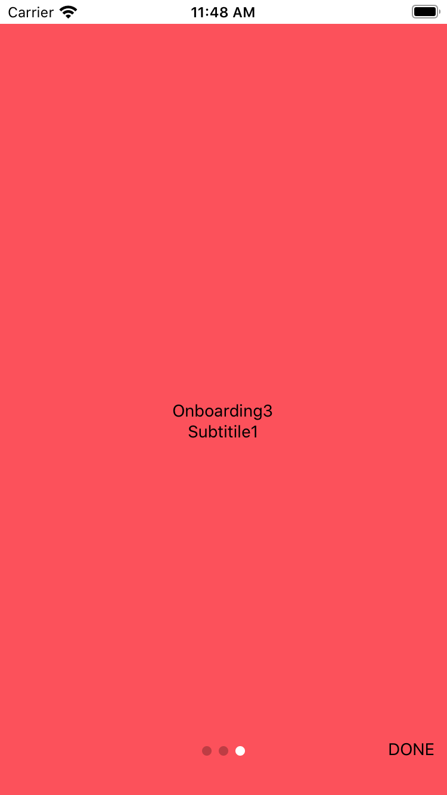

<h1>Introduction</h1>
INTUZ brings to you an amazing readymade component which allows you to integrate OnBoarding features inside your React Native based application supporting both Android and iOS platforms. Try it your self by following below instructions, Happy Coding.

  
<h1>Features</h1>

- Support to OnBoardingScreens with customisable Views and Images
- Customisable Next, Skip and Done buttons
- Customisable pagination dots

  
<h1>Getting Started</h1>

To use this component in your project you need to perform the below steps:

Import OnboardingScreens in your .js file

import OnboardingScreens from '../../components/OnboardingScreens/OnboardingScreens'

Render your OnboardingScreens inside class

 		<OnboardingScreens 
                        onSkipClick={this.onSkipBtnPressed.bind(this)}
                        onDoneClick={this.onDoneBtnPressed.bind(this)}
                        showDoneBtn={true}
                        showSkipBtn={true}
                        >
                        {/* First screen */}
                        <View style={[styles.slide, { backgroundColor: '#C04DEE' }]}>
                            <Text style={styles.header}>Onboarding1</Text>
                            <Text style={styles.text}>Subtitile1</Text>
                        </View>
                        {/* Second screen */}
                        <View style={[styles.slide, { backgroundColor: '#4AAFEE' }]}>
                            <Text style={styles.header}>Onboarding2</Text>
                            <Text style={styles.text}>Subtitile1</Text>
                        </View>
                        {/* Third screen */}
                        <View style={[styles.slide, { backgroundColor: '#FC515B' }]}>
                            <Text style={styles.header}>Onboarding3</Text>
                            <Text style={styles.text}>Subtitile1</Text>
                        </View>
                    </OnboardingScreens>

  
**<h1>Bugs and Feedback</h1>**
For bugs, questions and discussions please use the Github Issues.

  
**<h1>License</h1>**
The MIT License (MIT)
  
Copyright (c) 2020 INTUZ
  
Permission is hereby granted, free of charge, to any person obtaining a copy of this software and associated documentation files (the "Software"), to deal in the Software without restriction, including without limitation the rights to use, copy, modify, merge, publish, distribute, sublicense, and/or sell copies of the Software, and to permit persons to whom the Software is furnished to do so, subject to the following conditions: 
  
THE SOFTWARE IS PROVIDED "AS IS", WITHOUT WARRANTY OF ANY KIND, EXPRESS OR IMPLIED, INCLUDING BUT NOT LIMITED TO THE WARRANTIES OF MERCHANTABILITY, FITNESS FOR A PARTICULAR PURPOSE AND NONINFRINGEMENT. IN NO EVENT SHALL THE AUTHORS OR COPYRIGHT HOLDERS BE LIABLE FOR ANY CLAIM, DAMAGES OR OTHER LIABILITY, WHETHER IN AN ACTION OF CONTRACT, TORT OR OTHERWISE, ARISING FROM, OUT OF OR IN CONNECTION WITH THE SOFTWARE OR THE USE OR OTHER DEALINGS IN THE SOFTWARE.

 
<h1></h1>

